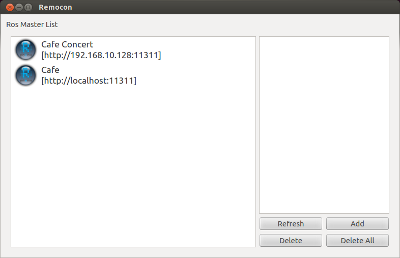
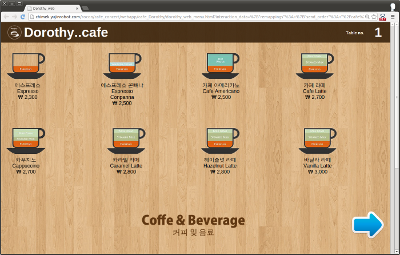
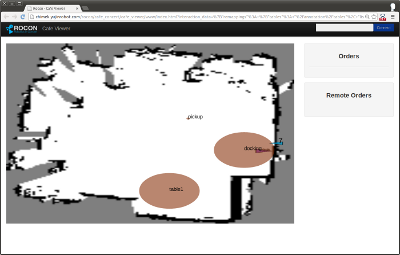
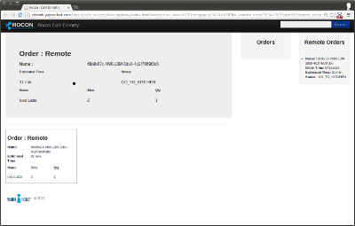

# How to start Cafe Simulation

## Preparation

- Dependency installation

<pre>
> sudo apt-get install ros-hydro-turtlebot ros-hydro-rocon ros-hydro-unique-identifier ros-hydro-bondpy ros-hydro-ar-track-alvar ros-hydro-kobuki-soft ros-hydro-rosbridge-suite ros-hydro-rospy-message-converter ros-hydro-smach-ros
</pre>

- Setup workspace with rosinstall file

<pre>
https://raw.githubusercontent.com/robotics-in-concert/rocon_demos/cafe_concert/cafe_concert/rosinstalls/concert_master.rosinstall
</pre>

- catkin_make

- Starts up Cafe Simulation

<pre>
> rocon_launch cafe_concert cafe_sim.concert --screen
</pre>

## Runtime

### Test with rocon_remocon

<pre>
 > rocon_remocon
</pre>

#### Cafe Viewer

* Launch `rocon_remocon`
* Choose Concert
* Cafe Manager -> Cafe Monitor

### Delivery Order 

* Launch `rocon_remocon`
* Choose Concert
* Customer -> Cafe Dorothy Delivery Order

 
    

